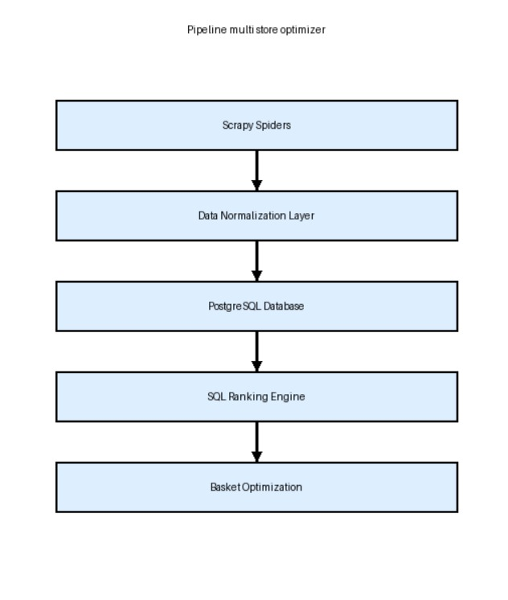

# Multi-store-optimizer.

This project aims to identify the supermarket or combination of supermarkets that provides the lowest total cost for a grocery basket, helping users plan their shopping in the most cost-efficient way.

The system implements a scalable data pipeline architecture capable of scraping product data, normalizing product information across stores, computing standardized unit prices, and ranking products by cost efficiency.

This project was designed with **future machine learning integration** in mind, including embedding-based product similarity and multi-store basket optimization.

## Project Overview

Multi-store-optimizer is a data pipeline designed to collect, normalize and analyze supermarket prices across multiple stores in Mexico. The goal is to build a system capable of identifying the cheapest grocery basket by combining products from different supermarkets.

# Real Data Collection

The system collects real product data from Mexican supermarket websites using Scrapy spiders.Currently supported stores include:

- Chedraui
- Soriana 
- La Gran Bodega

These supermarkets were selected because their websites allow responsible scraping according to their robots.txt policies.  

Each scraping run collects product information including:

- product name
- price
- store
- timestamp

The collected data is stored in a PostgreSQL database for further normalization and price analysis.

# Project Highlights

- Multi-store **web scraping pipeline** using Scrapy  
- **Product normalization system** using regex-based NLP  
- **Unit price standardization** for fair product comparison  
- **SQL ranking engine** for cost-efficient product analysis  
- Architecture designed for **scalability and ML integration**


# Problem/Motivation

The idea originated from everyday grocery shopping discussions with my brother by asking:

**When buying groceries, how can we know which store — or combination of stores — offers the lowest total cost for an entire shopping basket?**

Consumers usually compare prices product by product, but determining the optimal store combination is a more complex optimization problem often studied in Operations Research.
This system explores how such optimization could be applied to everyday consumer shopping. Even when individual product prices are visible, it is difficult to determine:

- which store offers the **lowest unit price**
- which **combination of stores** minimizes the total basket cost

This project addresses that problem by building a system capable of:

- collecting grocery prices across multiple stores
- normalizing product information
- computing standardized unit prices
- ranking products by cost efficiency

## Inquiries & Code Access
**Due to ongoing development and potential commercial applications, some components of this system are maintained in a private repository.**


# System Architecture

The system follows a modular **data pipeline architecture**:

```
Web Scrapers (Scrapy)
         ↓
Data Normalization Layer
         ↓
PostgreSQL Database
         ↓
SQL Ranking Engine
         ↓
Basket Optimization (future step)
```


Design principle: **Separate data extraction from product intelligence**. This allows the system to scale as more stores and product categories are added.

## Project Structure

```
multi-store-optimizer/

comercios/
    comercios/
        spiders/
            chedraui.py
            gran_bodega.py
            precios_comercios.py # For testing porpuses
            precios_searcher.py # For testing porpuses
            soriana.py
        items.py
        middlewares.py
        pipelines.py
        settings.py

    db/
        database.py

    utils/
        unidades.py
        parser.py

    main.py
    scrapy.cfg

Documentacion/
    Documentacion general.pdf
granbodega.html   # Testing
scraper.py        # Testing

```

## Pipeline

The pipeline processes every item extracted by the spiders and performs the following steps:
- Normalize product names
- Detect product brand
- Resolve canonical product
- Extract quantity and unit
- Store product if it doesn't exist
- Store price with timestamp
- Associate results with the search query

**Pipeline flow:**

Spider → Item → Pipeline → PostgreSQL

**Database Tables**

The pipeline interacts with the following tables:


| Table                   | Description                             |
| ----------------------- | --------------------------------------- |
| `productos`             | Canonical product names                 |
| `aliases_producto`      | Maps search terms to canonical products |
| `productos_encontrados` | Store-specific product listings         |
| `precios`               | Historical price tracking               |
| `marcas`                | Detected brands                         |


## Key Pipelines Features

**Text Normalization**

Product names are normalized to simplify comparisons.

Example: "Leche Alpura 1L" → "leche alpura 1l"

Includes:
- lowercase conversion
- accent removal
- special character cleanup

**Brand Detection**

- Exact match against validated brands
- Fuzzy matching using RapidFuzz
- Heuristic detection for unknown brands

New potential brands are automatically stored for later validation.

**Unit Extraction**

Product units are extracted from product titles using:
```utils/unidades.py```

Example:

| Product    | Quantity | Unit |
| ---------- | -------- | ---- |
| Arroz 500g | 500      | g    |
| Leche 1L   | 1        | L    |

This allows price-per-unit comparisons.

# Technology Stack

- **Python**
- **Scrapy** — Web scraping
- **PostgreSQL** — Data storage
- **SQL Views** — Ranking queries
- **Regex-based NLP** — Product normalization


# Product Normalization Pipeline

Raw product names scraped from websites are transformed into structured product attributes.
Example:

**Raw product name: Leche Alpura Deslactosada 1L**

Structured output:
```
product_base: milk
brand: alpura
quantity: 1000
unit: ml
```

This allows the system to compare products **across brands and packaging sizes**.

# Unit Price Calculation

To fairly compare products with different package sizes, prices are normalized using: unit_price = price / quantity

Example [add a picture]

# Price Ranking

Products are ranked by lowest **unit price** within the same product category.

Example SQL query:

```sql
SELECT *
FROM ranking_productos
WHERE producto_base = 'leche'
ORDER BY precio_unitario ASC;
```
This allows users to identify the most cost-efficient product option.


# Repository Status & Future Improvements

This repository is currently under active development.

Current capabilities:

- Multi-store product scraping
- Product normalization
- Unit price computation
- SQL-based product ranking
  
The system was intentionally designed to support machine learning extensions.Planned features include:

- Location-aware scraping to prioritize supermarkets near the user's region, improving relevance of price comparisons.
- Embedding-based product similarity: Use vector embeddings to improve product matching across stores where product names differ.
- Shopping basket optimization: Compute the minimum cost combination of stores for an entire grocery basket.
- API layer: Expose the ranking and comparison engine through a REST API.
- User interface for real-world deployment.

This system is intended to serve as the first layer of a larger project focused on personalized nutrition systems.
The long-term goal is to connect dietary recommendation systems with grocery price optimization. A diet application would generate a list of ingredients for recipes, and the optimizer would then compute the most cost-efficient stores for purchasing them.

## Example Usage

```
SELECT *
FROM ranking_productos
ORDER BY precio_unitario ASC
LIMIT 3;
```

| producto_id | nombre                                             | tienda   | marca | precio | cantidad_base | unidad_base | precio_unitario |
|-------------|----------------------------------------------------|----------|-------|--------|---------------|-------------|-----------------|
| 4 | Refresco Coca-Cola Sin Azúcar 3L | Chedraui |  | 38.0 | 3000 | ml | 0.012666666666666666 |
| 3 | Leche Entera Valley Foods 1 Litro | Soriana |  | 16.1 | 1000 | ml | 0.0161 |
| 4 | Refresco Coca-Cola Original 3L | Chedraui |  | 50.0 | 3000 | ml | 0.016666666666666666 |
| 3 | Producto Lácteo Combinado Precíssimo 1 L | Soriana |  | 17.0 | 1000 | ml | 0.017 |

```
SELECT
    p.producto_id,
    pe.nombre,
    pe.cantidad_base
FROM precios p
JOIN productos_encontrados pe
    ON pe.id = p.producto_encontrado_id
LIMIT 5;
```

| producto_id | nombre                                   | cantidad_base |
|-------------|-------------------------------------------|---------------|
| 3 | Leche Caracol Entera 1 Galón | 1 |
| 3 | Leche Alpura Clásica Pasteurizada 1 L | 1000 |
| 3 | Leche Evaporada Sello Rojo 1 L | 1000 |
| 3 | Leche Caracol Low Fat 1 Galón | 1 |
| 3 | Tinte Nutrisse 7.777 Café/Leche 1 Pieza | 1 |

All share the same producto_id due to the id is linked to the main product in this case "leche"

## Basket Optimization (Under Development)

The next step of the project is implementing a shopping basket optimization engine. The goal is to determine the lowest total cost for a user's grocery list across multiple stores.
Example input:

```
User shopping list:
- milk
- eggs
- rice
- yogurt
```

The system will:
- Match each item to comparable products across stores
- Retrieve the best unit price for each product
- Evaluate different store combinations

Return the minimum-cost basket

**Cost Function**

The total cost of a shopping basket will be computed as:
```Total Basket Cost = Σ product_price(store_i)```
Where each product may be purchased from a different store depending on price.

**Optimization Challenge**

If the system evaluates multiple stores, the number of possible combinations grows quickly.
```
5 products × 3 stores
Possible combinations = 3^5 = 243
```
The optimization module will evaluate these combinations and return the lowest-cost solution.

**Planned Implementation**

The first implementation will use a brute-force search with pruning, which is sufficient for small shopping lists. Future versions will explore optimization techniques to improve performance.

Future versions may implement:
- dynamic programming
- linear optimization
- heuristic search
- multivariable minimax
- stochastic gradient descent


## Potential Applications

Although this project focuses on grocery price intelligence, the same architecture can be applied to other domains such as:
- supplier cost optimization in supply chains
- procurement analysis for organizations
- price monitoring systems
- consumer price comparison platforms
